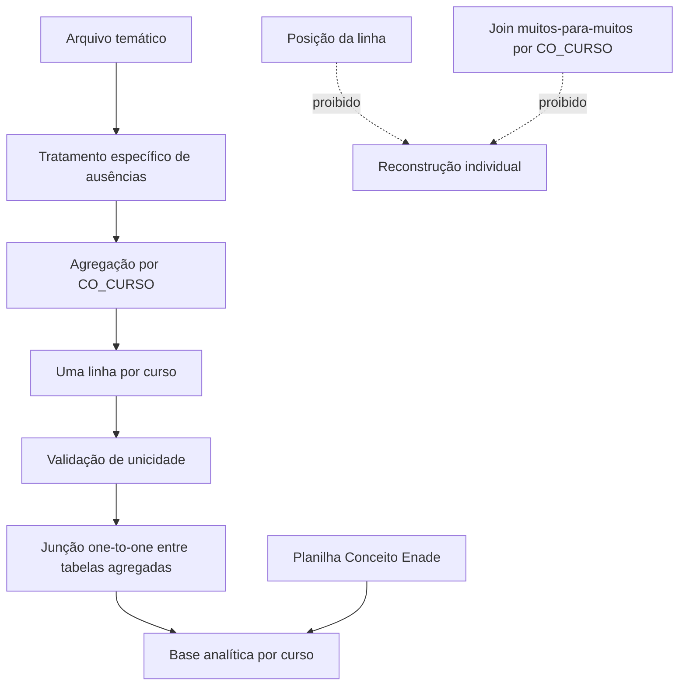

# Arquitetura do projeto

## 1. Objetivo arquitetural

O projeto transforma os microdados do Enade das Licenciaturas 2025 em bases analíticas por curso, comparações institucionais e territoriais, figuras e relatórios técnico-científicos.

A arquitetura foi desenhada para impedir relações indevidas entre registros individuais de arquivos temáticos distintos.

## 2. Unidade principal

A unidade principal é:

```text
CO_CURSO
```

`CO_CURSO` identifica o curso/oferta para fins de agregação. Ele **não identifica estudante**.

## 3. Fluxo de dados



Regras:

- não existe identificador público comum de estudante entre os arquivos temáticos;
- posição da linha não é chave;
- não se cria identificador artificial;
- cada lado de uma junção temática deve possuir uma linha por `CO_CURSO`;
- duplicidade em junção agregada é erro impeditivo;
- associações entre temas distintos são ecológicas.

## 4. Núcleo compartilhado

### `src/core/`

Contratos estruturais reutilizados pelas áreas:

- `ConfiguracaoArea`: slug, nome, `CO_GRUPO` e IES focal;
- preparação e normalização do catálogo;
- validação de unicidade por curso;
- junções one-to-one;
- validação estrutural da base;
- aplicação dos grupos comparativos.

A IES focal é a UFPA (`CO_IES=569`).

### `src/agregacao/`

Agregações temáticas compartilhadas:

- desempenho;
- demografia;
- trajetória;
- perfil socioeconômico;
- processo formativo;
- recomendação.

### `src/analise/`

Funções analíticas compartilhadas:

- estatísticas descritivas;
- benchmarks;
- sensibilidade;
- tamanhos de efeito;
- consistência de dimensões;
- validação de indicadores.

### `src/validacao/`

Contratos de integridade e validações de catálogo, grupos, agregações, relacionamentos e resultados.

### `src/relatorios/`

Infraestrutura compartilhada para:

- formatação;
- tabelas e figuras;
- referências;
- geração de DOCX;
- conversão opcional para PDF;
- contratos de resultado e validação de relatório.

### Outros componentes

- `src/configuracao/`: caminhos e leitura de configuração;
- `src/extracao/`: extração do ZIP oficial;
- `src/qualidade/`: inspeção e auditorias;
- `src/utilitarios/`: leitura, normalização e logs.

## 5. Ciclo de vida dos módulos por área

Pacotes específicos de áreas existem somente enquanto a área está em desenvolvimento.

Depois da entrega final:

- relatório e apresentação são arquivados;
- um snapshot/tag preserva o código que gerou a entrega;
- módulos, executores e testes exclusivos da área podem ser aposentados do branch operacional.

No estado atual, as áreas Matemática, Física, Letras–Inglês, Ciências Biológicas, Pedagogia, Letras–Português e Geografia estão arquivadas. Química permanece cadastrada, mas ainda sem pipeline operacional novo.

O núcleo compartilhado permanece em:

```text
src/core/
src/agregacao/
src/analise/
src/configuracao/
src/extracao/
src/qualidade/
src/relatorios/
src/utilitarios/
src/validacao/
```

A existência de configurações históricas em `src/core/configuracao_area.py` não significa que seus pipelines estejam ativos.

## 6. Camadas de produto

```text
fontes oficiais
↓
dados_extraidos/
↓
dados_processados/<area>/
↓
figuras/<area>/
↓
relatorios/<area>/
```

### Fontes oficiais

Localizadas em `dados_brutos/` e não versionadas.

### Dados extraídos

Cache regenerável do ZIP oficial.

### Dados processados

Produtos derivados, normalmente locais e regeneráveis.

### Figuras

Produtos derivados dos pipelines analíticos.

### Relatórios

Os geradores consomem produtos agregados e validados. Não reconstroem vínculos individuais entre arquivos.

## 7. Testes

```text
tests/unit/
tests/integration/
```

Testes unitários usam dados sintéticos ou funções isoladas. Testes de integração podem depender de produtos reais locais e são marcados com `integration`.

## 8. Configuração das áreas

O registro central fica em `src/core/configuracao_area.py` e a configuração de arquivos e parâmetros de leitura fica em `config.yaml`.

A presença de uma área no registro central apenas permite parametrização; não equivale à conclusão de seu pipeline analítico.
