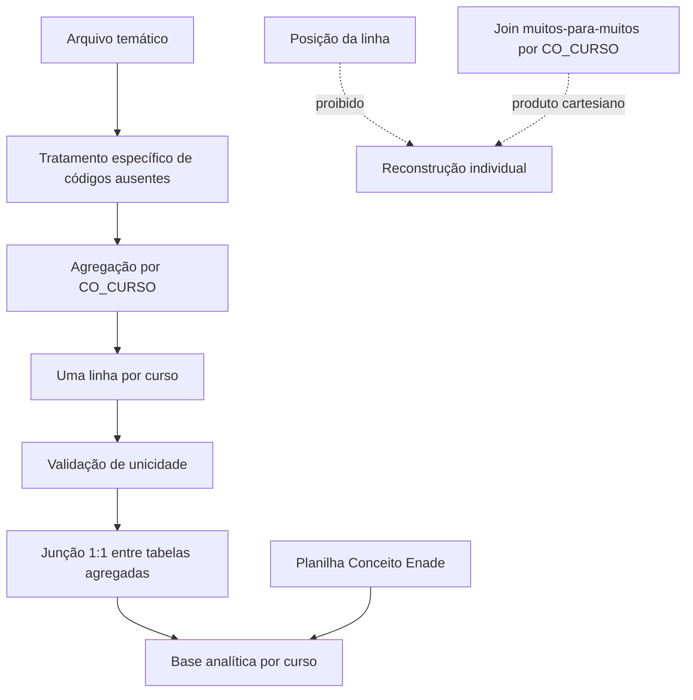

# Diagrama de relacionamento dos microdados

## Regras

- Não existe identificador público comum de estudante.
- A posição da linha não é chave.
- `CO_CURSO` é chave de agregação, não identificador individual.
- Toda junção entre temas exige uma linha por `CO_CURSO` em cada lado.
- Associações entre indicadores de temas distintos são ecológicas e não individuais.
